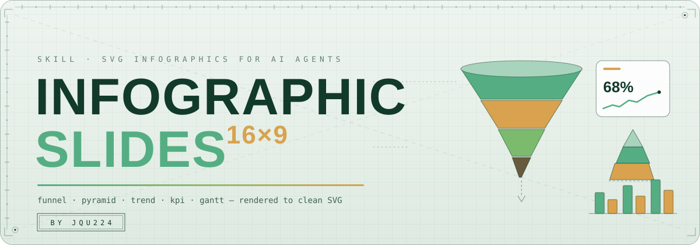

<div align="center">

</div>

<div align="center">
<pre>~/infographic-slides (main*)   components 16   palettes 9   render-matrix 144/144</pre>
</div>

<div align="center">

[](README.md) [](README.zh-CN.md)

</div>

## infographic-slides

AI 绘制的商务信息图,输出干净的 SVG。

— **16 个 3D 立体组件 · 9 套多色配色 · 经 AntV 桥接再获 200 套模板。**


**infographic-slides** 是给 AI Agent 用的绘图技能:给它原始数据,它交付汇报级的 SVG 信息图——漏斗、金字塔、趋势房间、循环闭环、KPI 看板、甘特图——可直接嵌入 HTML、Markdown、PowerPoint 与 Figma。

**上手三步**

1. 读 [SKILL.md](SKILL.md) —— Agent 的工作流:选组件、选配色、渲染、交付。
2. 跑 `node scripts/render.mjs --tpl funnel-3d` —— 示例数据零参数,几秒出第一张 SVG。
3. 打开 `catalog.html` —— 16 组件 × 9 配色全量画廊;随时 `node scripts/catalog.mjs` 重建。

---

| | 定位 |
|---|---|
| **它是什么** | 参数化 SVG 信息图组件库 + Agent 技能入口,主打高级感多色 3D 商务风 |
| **谁来渲染** | 任意编码 Agent(Claude Code、ZCode、Codex、Cursor),或有 Node ≥ 18 的人 |
| **核心依赖** | 零 —— 核心渲染器是纯字符串模板 + 系统字体栈,离线安全 |
| **扩展引擎** | `scripts/antv-bridge.mjs` 以服务端方式驱动 [antvis/Infographic](https://github.com/antvis/infographic)(MIT),再获 200 套模板 |
| **视觉规则** | 多色 series 配色 + 明暗面拆分 + 单一左上光源;蓝紫主调是被禁止的默认项 |

| 流水线 | |
|---|---|
| **渲染路径** | 数据进,一个组件 + 一套配色出,SVG 落盘 |
| **验证** | 组件 × 配色全矩阵在 `node scripts/catalog.mjs` 中渲染(当前 144/144);每个组件在 `library/<id>/` 下自带示例数据 |

```text
user data ──► SKILL.md picks component + palette ──┬─► library/<id>/template.js ──► render.mjs ──► output/*.svg (+ --html)
                                                   └─► scripts/antv-bridge.mjs ──► @antv/infographic SSR
all SVGs ──► scripts/catalog.mjs ──► catalog.html gallery
```

| 仓库结构 | |
|---|---|
| `SKILL.md` | 面向 Agent 的技能入口:组件选型、配色规则、渲染命令、交付清单 |
| `library/` | 16 个组件,每组件一个目录:`template.js` + `meta.json` + `data.example.json` |
| `library/_shared/svg.mjs` | 零依赖 SVG 工具箱:体积渐变、等距 3D 盒体、文字适配、迷你图标集 |
| `palettes/index.json` | 9 套多色配色;首项为默认(`verdant`) |
| `scripts/render.mjs` | 命令行:`--tpl <id> --data <json> --palette <id> --out <svg> --html` |
| `scripts/antv-bridge.mjs` | AntV Infographic 语法 → SVG,走 Node SSR(linkedom) |
| `scripts/catalog.mjs` | 重建 `catalog.html` 组件 × 配色画廊 |
| `docs/svg-drawing-guide.md` | SVG 怎么画怎么调:3D 光学、防溢出、调参地图 |
| `docs/assets/hero.svg` | 仓库 Hero 横幅 |
| `examples/` | 端到端试验用的真实感数据集 |
| `research/` | 上游调研笔记;antvis 源码克隆不入库 |

| 契约 | |
|---|---|
| **组件** | `template.js` 导出 `render({ data, palette, w, h, opts }) → svg 字符串`;`meta.json` 声明 id、分类、标签、数据 schema 与容量上限(`bestFor`) |
| **配色** | 每套配色含 `series[]`(多色,按下标循环)、`text`、`subtext`、`line`、`bg`、`accent`、`dark`;渐变 ID 带组件前缀,内联到 HTML 时安全 |
| **数据** | `title` + `subtitle` + 每组件恰好一个主数组字段;数值保持纯数值;`meta.json` 里的容量上限是硬限制 |

| 用法 | 命令 |
|---|---|
| 示例数据渲染 | `node scripts/render.mjs --tpl funnel-3d` |
| 真实数据 + 配色 + HTML 包装 | `node scripts/render.mjs --tpl pyramid-3d --data examples/saas-funnel.json --palette bluegold --html` |
| 桥接 200 套 AntV 模板 | `node scripts/antv-bridge.mjs --demo pyramid` |
| 从文件渲染 AntV 语法 | `node scripts/antv-bridge.mjs --syntax examples/antv-org-sytax.txt --out output/timeline.svg` |
| 重建画廊 | `node scripts/catalog.mjs` |

| 给 AI Agent | |
|---|---|
| **安装** | 把 `SKILL.md` + `library/` + `scripts/` + `palettes/` 拷入 Agent 的技能目录,或让 Agent 直接读本仓库 |
| **触发** | 信息图 / 图表 / infographic / 可视化 / PPT 配图 |
| **语言锁定** | 图中文案跟随用户输入语言 |
| **选型** | 逐级递减 → `funnel-3d`;层级 → `pyramid-3d`;时间序列 → `trend-3d`;循环 → `cycle-3d`;里程碑 → `timeline-3d`;双方对比 → `compare`;战略扫描 → `swot`;指标行 → `kpi-cards`;排期 → `gantt` |
